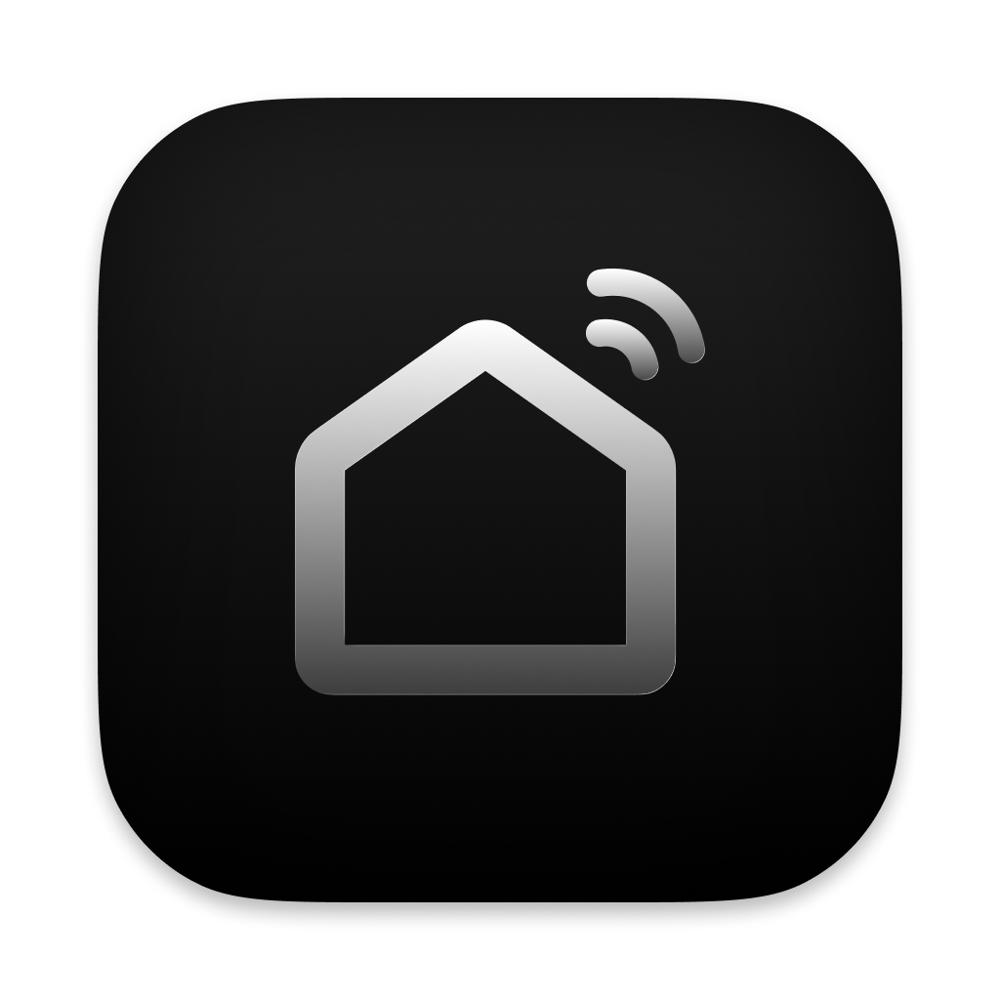
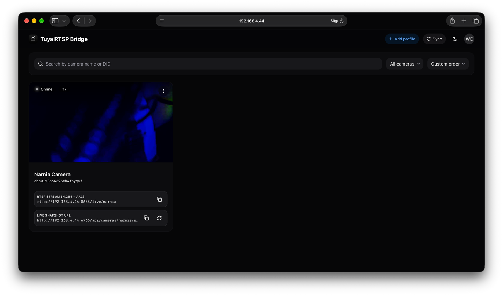

# scrypted-tuya & Tuya Camera Bridge

[](CHANGELOG.md)
[](LICENSE)
[](https://github.com/resonaura/scrypted-tuya/actions/workflows/publish.yaml)
[](https://www.home-assistant.io/)
[](bridge/apps/native)
[](https://scrypted.app)
[](https://github.com/resonaura/scrypted-tuya/pkgs/container/tuya-rtsp-bridge)

[](https://buymeacoffee.com/resonaura)

Unofficial standalone Scrypted Tuya / Smart Life camera plugin & companion Home Assistant WebRTC-to-RTSP bridge.

Extracted from [`plugins/tuya`](https://github.com/koush/scrypted/tree/main/plugins/tuya) and significantly extended with:

- **Maximum quality selection** — requests the highest writable quality advertised by each camera before RTSP allocation.
- **Smart Life P2P bridge** — companion Home Assistant add-on with a custom C++ WebRTC-to-RTSP streaming engine.

> This project is unofficial and is not affiliated with or endorsed by Scrypted or Tuya.

<p align="center">
  
</p>

---

## Features

- Tuya and Smart Life camera discovery via MQTT.
- Cloud RTSP camera streaming.
- Maximum advertised video-quality selection with safe fallback.
- Tuya doorbell ring notifications.
- Motion events on supported devices.
- Camera indicator and floodlight controls when exposed by the device.
- QR-code login flow (Tuya / Smart Life app — no developer keys required).

---

## Home Assistant — Tuya Camera Bridge Add-on

For cameras that stream at low resolution via Tuya Cloud RTSP (or not at all), use the companion add-on in the `bridge/` folder. It runs a custom C++ streaming engine that:

1. Authenticates via Smart Life QR code (scanned once from the Web UI).
2. Opens a WebRTC P2P session to the camera using the Tuya protocol.
3. Re-streams it as a standard RTSP feed on your local network.

### 1-Click Install via Home Assistant

[](https://my.home-assistant.io/redirect/supervisor_add_addon_repository/?repository_url=https%3A%2F%2Fgithub.com%2Fresonaura%2Fscrypted-tuya)

### Manual Install (Home Assistant)

1. **Settings → Add-ons → Add-on Store → ⋮ → Repositories**
2. Add `https://github.com/resonaura/scrypted-tuya`
3. Install **Tuya Camera Bridge** → Start
4. Open the Web UI (ingress or `http://<ha-host>:6767`)
5. Create a profile → scan the QR code in Smart Life
6. Copy the RTSP URL shown on the camera card, e.g. `rtsp://<ha-host>:8655/<CameraName>`
7. In Scrypted → camera settings → **Smart Life P2P HD RTSP URL** → paste URL

The Scrypted plugin continues handling discovery, motion, doorbell events and controls. Video comes from the P2P bridge.

---

## Standalone Docker (without Home Assistant)

You can run the Tuya Camera Bridge on any Linux/macOS machine with Docker:

### Using Docker Compose (Recommended)

Clone the repository and run:

```bash
git clone https://github.com/resonaura/scrypted-tuya.git
cd scrypted-tuya/bridge
docker compose up -d --build
```

Example `docker-compose.yml`:

```yaml
services:
  tuya-bridge:
    build:
      context: .
      dockerfile: Dockerfile
    container_name: tuya-bridge
    restart: unless-stopped
    # CRITICAL: host network mode is required for camera P2P WebRTC / UDP discovery
    network_mode: host
    environment:
      - PORT=6766
      - WEB_PORT=6767
      - RTSP_BASE_PORT=8655
      # Optional: set LAN IP explicitly if auto-detection fails:
      # - RTSP_HOST=192.168.1.50
      - LOG_LEVEL=info
    volumes:
      - ./data:/data/tuya-bridge
      - ./config:/config/tuya-bridge
```

### Using `docker run`

```bash
docker run -d \
  --name tuya-bridge \
  --restart unless-stopped \
  --network host \
  -v $(pwd)/data:/data/tuya-bridge \
  -v $(pwd)/config:/config/tuya-bridge \
  ghcr.io/resonaura/tuya-rtsp-bridge:latest
```

After starting, open `http://<host-ip>:6767` in your browser.

### Network Ports

| Port | Protocol | Purpose |
|------|----------|---------|
| `6766` | TCP | REST / WebSocket API |
| `6767` | TCP | Web UI dashboard |
| `8655+` | TCP/UDP | RTSP streams (one per camera, starting at 8655) |

---

## Authentication (Scrypted plugin)

The recommended login method is the QR-code flow from the Tuya or Smart Life application. The legacy Tuya Developer Account login remains available for existing configurations.

---

## Development

Requirements: Node.js, npm, a Scrypted server for deployment.

```bash
npm ci
npm run typecheck
npm run build
```

The plugin archive is generated at `out/plugin.zip`.

---

## Attribution

The original Tuya plugin was written by the [Scrypted](https://github.com/koush/scrypted) contributors. This standalone fork is based on upstream commit [`abd37e4`](https://github.com/koush/scrypted/commit/abd37e416dba4e36bcf9768ab6bbf1e82a206dd9).

The bridge add-on was originally inspired by **[DanEng1982/tuya-rtsp-bridge](https://github.com/DanEng1982/tuya-rtsp-bridge)**. We are grateful for their pioneering work. The current add-on is a full from-scratch rewrite with a custom C++ engine, NestJS backend, and React frontend.

---

## License

See `UPSTREAM-LICENSE-NOTICE.md`. Review upstream terms before redistributing.
